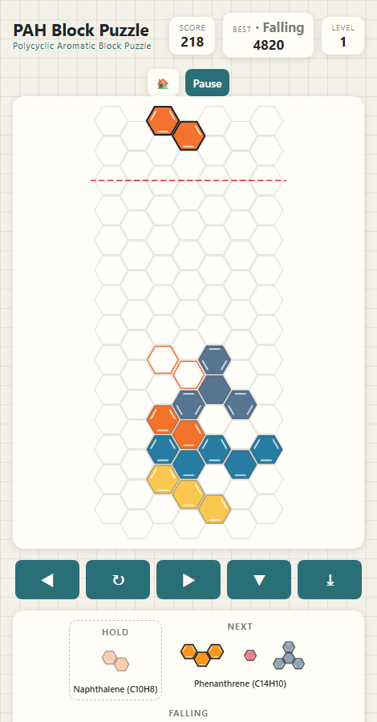
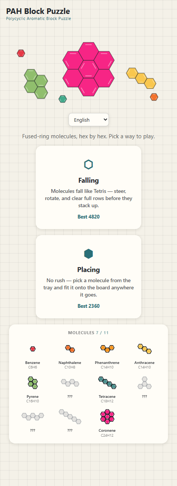

# PAH Block Puzzle

実在する多環芳香族炭化水素（PAH）でできたブロックパズル。ベンゼンからコロネンまでを
六角格子の上に、正しいKekulé構造で描いています。

**[▶ ブラウザで遊ぶ](https://kkaakkeehh-beep.github.io/PAH_Block_Puzzle/)** ·
[English README](README.md)

<p align="center">
  
  
</p>

インストール不要、ビルド不要、アカウント不要、トラッキングなし。GitHub Pages から
配信される数個の静的ファイルだけで動いています。

## 2つのモード

**フォーリング** — テトリスのように分子が落ちてきます。移動・回転させて、赤いデッド
ラインを越える前に列を消してください。レベルは「消したライン数」と「経過時間」の
両方から上がるので、一度も列を消せなくても難度は上がっていきます。

**プレイシング** — 時間制限なし。トレイから分子を選び、入る場所に置いていきます。
列を消しても残りのブロックは落ちてこないので、反応速度ではなく詰め込みの問題に
なります。

自己ベストはモードごとに別々に記録されます。

## 化学の話

すべてのピースが実在の分子で、コードはそれを飾りではなく「正しくあるべきもの」として
扱っています。

**環の配置は分子式と照合済みです。** 六角形が軸座標で1ステップ隣ならortho縮合、
3つが互いに隣接していれば1個の炭素を共有するperi縮合です。六角形の和集合の頂点を
数えれば炭素数と水素数が直接出るので、11分子すべてがゲーム内表示の分子式と厳密に
一致することを確認しています。

**二重結合はデータではなく導出されます。** 環の中の円は6個の非局在π電子を意味する
ので、縮合環系の全部の環に円を描くとπ電子を二重に数えることになります（ナフタレンは
10個なのに12個に見えてしまう）。そこで `kekuleBondsFromCorners` が六角形の頂点から
炭素骨格を組み立て、完全マッチングを求めます。これにより全炭素がちょうど1本ずつ
二重結合を持ちます。

Kekulé構造は通常複数あるため、すべて列挙したうえで**炭素を共有しない芳香族六隅子
（sextet）が最大になるもの**を選びます。これがClar則で、最も寄与の大きい共鳴構造に
あたります。同点の場合は、環の縮合結合上の二重結合が最少になるものを選びます。
結果として、教科書どおりの構造になります。

| 分子 | 分子式 | 環 | Clar sextet |
|---|---|---|---|
| ベンゼン | C₆H₆ | 1 | 1 |
| ナフタレン | C₁₀H₈ | 2 | 1 |
| フェナントレン | C₁₄H₁₀ | 3（屈曲） | 2 |
| アントラセン | C₁₄H₁₀ | 3（直線） | 1 |
| ピレン | C₁₆H₁₀ | 4（peri縮合） | 2 |
| クリセン | C₁₈H₁₂ | 4（ジグザグ） | 2 |
| テトラセン | C₁₈H₁₂ | 4（直線） | 1 |
| トリフェニレン | C₁₈H₁₂ | 4（分岐） | 3 |
| ピセン | C₂₂H₁₄ | 5（ジグザグ） | 3 |
| ペンタセン | C₂₂H₁₄ | 5（直線） | 1 |
| コロネン | C₂₄H₁₂ | 7（peri縮合） | 3 |

フェナントレンは両端の環に3本ずつ、中央にC9=C10が1本だけという形になります。
トリフェニレンは外側3環が交互結合で中心環は空。アントラセンはsextetが1つだけで、
これが同じC₁₄H₁₀の異性体であるフェナントレンより不安定な理由です。

ホーム画面には11分子の図鑑があり、実際に設置するまではグレーのシルエットで表示
されます。

## 操作方法

ゲーム内でも、選んだモードに応じて開始前に表示されます。

**フォーリング**

| | キーボード | タッチ |
|---|---|---|
| 移動 | ← → | スワイプ ←→、または ◀ ▶ |
| 回転 | ↑ または R | スワイプ ↑、または ↻ |
| ソフトドロップ | ↓ | ▼ |
| ハードドロップ | Space | スワイプ ↓、⤓、または ▼ を2回タップ |
| ホールド | C または Shift | ホールド欄をタップ |
| 一時停止 | P | — |

**プレイシング** — `1`/`2`/`3` または `Tab` で分子を選択、矢印キーで移動、`R` で回転、
`Enter`/`Space` で設置、`Esc` で解除。マウスの場合は分子をクリックしてから盤面を
クリック。タッチの場合はトレイから盤面へドラッグして位置を決め、タップで確定します。

## 六角形の向き

フォーリングモードでは選べます。六角格子では、縦と横の両方を同時にまっすぐには
できません。

- **フラットトップ** — 落下は完全にまっすぐ。左右移動が斜めにずれます。
- **ポインティトップ** — 左右移動が完全にまっすぐ。落下が斜めにずれます（行の偶奇で
  交互に振れることで、全体としては垂直を保ちます）。

## 対応言語

English, 日本語, 简体中文, 繁體中文, 한국어, Български, Deutsch, Eesti,
Ελληνικά, Español, Français, Italiano, Polski, Русский, Українська, Suomi の16言語。

ブラウザの設定から自動選択され、ホーム画面で変更できます。

## ローカルでの実行

ビルド手順も依存パッケージもありません。`index.html` を直接開くか、言語設定を
保持したい場合はHTTPで配信してください。

```bash
python3 -m http.server 8000
```

スコア・言語・図鑑は `localStorage` に保存されます。サーバーにもCookieにも保存
されないので、データが端末外に出ることはなく、端末間で共有もされません。

## ファイル構成

| ファイル | |
|---|---|
| `index.html` | マークアップ、メタデータ、ホーム画面のイラスト |
| `hexmath.js` | 軸座標⇔オフセット座標、回転、2つの向きの処理 |
| `pieces.js` | 11分子の定義と重み付きランダム選択 |
| `board.js` | 盤面状態、ライン消去、描画、Kekulé構造 |
| `game.js` | モード、入力、スコア、画面遷移 |
| `i18n.js` | 16言語の翻訳 |
| `og-source.html` | `og.png` の生成元（ヘッドレスChromeでラスタライズ） |

`index.html` はスクリプトを `?v=` 付きで読み込んでいます。GitHub Pages は10分間の
max-age を付けて配信するため、これが無いと「新しい index.html」と「キャッシュされた
古い game.js」の組み合わせが発生し、要素はあるのにイベントハンドラが付いていない
状態になります。**スクリプトかCSSを変更したデプロイでは必ずバージョンを更新して
ください。**

## ライセンス

MIT — [LICENSE](LICENSE) を参照してください。
